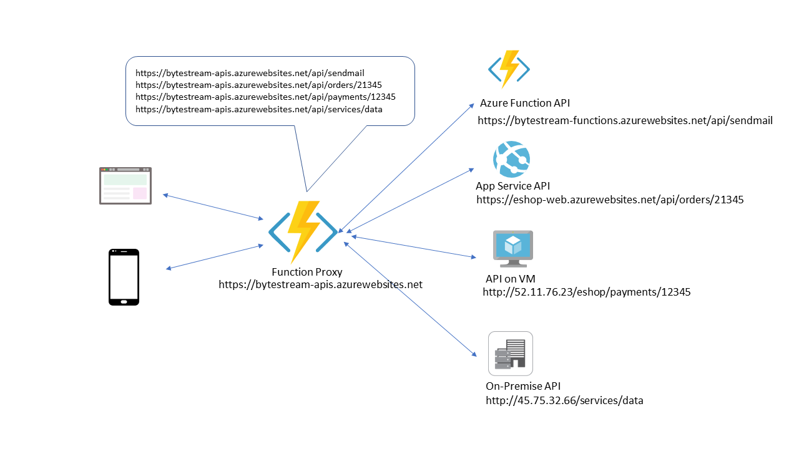

# Azure Function Proxy Tutorial

## What is Azure Function Proxy?
Azure Function Proxies are part of Azure Function App that helps you to manage the API endpoints on your function app that are implemented by other resources. Your APIs can be deployed in App Service API App, Function App, Virtual machines or other servers. When you deploy a large application (typically a microservice application) into different servers, they will be exposed by different API endpoints. You can use the Azure Function proxy to provide a common host name for app APIs running on different backend services. Using function proxies you can also override the reqeust and response objects. If you want to implement a mock API for testing, you can use the function proxy without a backend url property.

