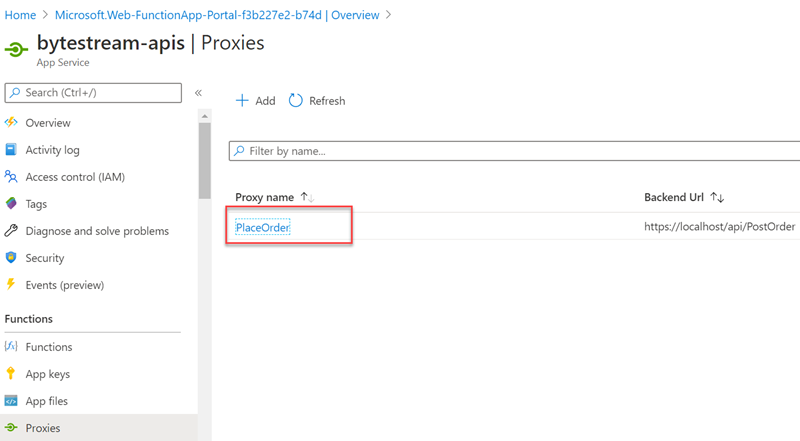
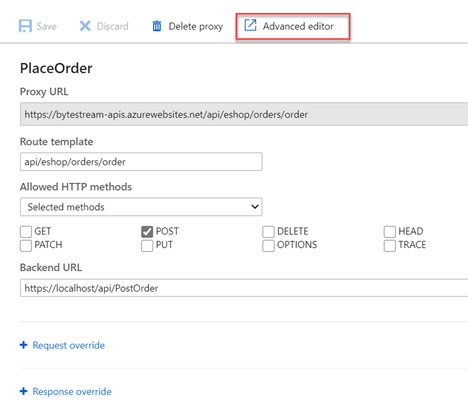
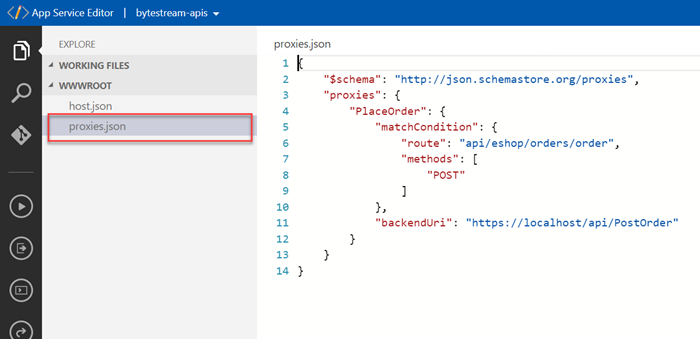

# Azure Function Proxy Tutorial

## What is Azure Function Proxy?
Azure Function Proxies are part of Azure Function App that helps you to manage the API endpoints on your function app that are implemented by other resources. Your APIs can be deployed in App Service API App, Function App, Virtual machines or other servers. When you deploy a large application (typically a microservice application) into different servers, they will be exposed by different API endpoints. You can use the Azure Function proxy to provide a common host name for app APIs running on different backend services. Using function proxies you can also override the reqeust and response objects. If you want to implement a mock API for testing, you can use the function proxy without a backend url property.
> [!IMPORTANT]
> Standard Functions billing applies to proxy executions.


### Modify the request and response
You can modify the request object to the backend api service using proxy. You can use the *Appication Settings* values with in the request. For example, you can make the backend url value as a dynamic value by refering to the AppSetting value. In the below proxy configuration you can see the `GetCountries` proxy is sending requests to the backend service defined by the %UTILS_HOST% settings value.
```
"CountriesList": {
    "matchCondition": {
        "route": "/api/utils/countries",
        "methods": [ "GET" ]
    },
    "backendUri": "%UTILS_HOST%/api/GetCountries"
}
```
> [!TIP]
> You can use `localhost` to reference a function inside the same function app directly, without a roundtrip proxy request. 
> `"backendurl": "https://localhost/api/GetCountries"` will reference a local HTTP triggered function at the route `/api/GetCountries`.

You can also use the Url parameters of the incoming requests to the backend uri. For example, in the below configuration we are accepting `{code}` as a url parameter for proxy url and the same is passed to the backend url.
```
"CountryByCode": {
    "matchCondition": {
        "route": "/api/utils/countries/{code}", 
        "methods": [ "GET" ]
    },
    "backendUri": "%UTILS_HOST%/api/GetCountryByCode/{code}"
}
```
You can override the reqeust methods too. For example, If the backend api is implemeted as a `POST` request uri, then you can define a proxy for that backend service with a `GET` uri. You will be overriding the `POST` method with a `GET` request method. 
```
"ServerTime": {
    "matchCondition": {
        "route": "/api/utils/time",
        "methods": [ "GET" ]
    },
    "requestOverrides": {
        "backend.request.method": "POST"
    },
    "backendUri": "%UTILS_HOST%/api/GetCurrentTime"
},
```
You can also create mock APIs for development and testing purposes using function proxies. You can override the response object and provide a static response to the caller. In such cases it is not necessary to define the `backendUri` property of the proxy configuration. Find the below configuration for defining a mock API.
```
"PaymentStatus": {
    "matchCondition": {
        "route": "/api/eshop/payments/status/{orderId}",
        "methods": [ "GET" ]
    },
    "responseOverrides": {
        "response.body": {
            "OrderId": "{orderId}",
            "Status": "Completed"
        },
        "response.statusCode": "200",
        "response.headers.Content-Type": "application/json"      
    }
}
```
## Creating and configuring Function Proxies using Azure Portal
1) Open Azure Portal and create a new Function App.
2) Open the Function App and select `Proxies` from the Functions section. Click on the Add button to create a new Proxy.
    
3) In the `New Proxy` dialog window, specify the name of the Proxy, Route Template, Http methods and the backend URL. Optionally you can specify the `Request override` and `Response override` configuration. Click `Create` to create the new proxy.
    
4) After the proxy is created you can click on the proxy name to see the details.
    
5) Click on the `Advanced Editor` to open the proxy configuration in a new window.
     
6) You can see a JSON file that contains the proxy configuration. Note that the proxy configuration is stored in `proxies.json` file.
    
7) Now, you can copy the proxy URL and test using a browser or any other tool like Postman.

